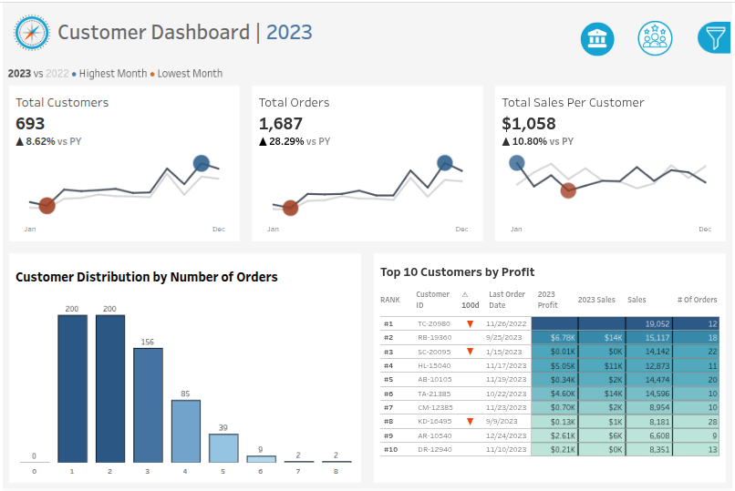
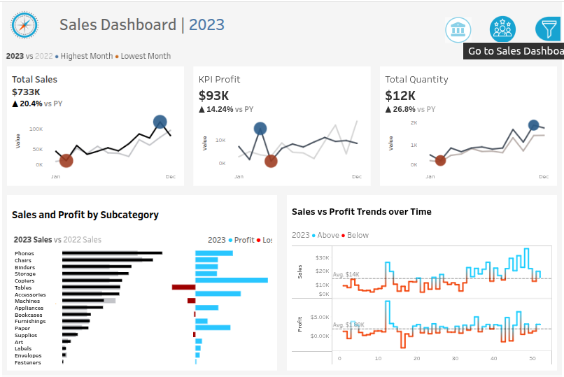

# Sales & Customer Performance Dashboard

An interactive Tableau dashboard providing sales and customer insights for 2023, with year-over-year comparisons to 2022.

Built to give sales and customer success teams a clear view of business performance:
- **Sales Dashboard** — Monitor revenue, profit KPIs, and identify which subcategories drive vs. drain profitability.
- **Customer Dashboard** — Track customer growth, order behaviour, and surface the highest-value accounts.

---

## 📊 Dashboard Preview

  
  

> *Preview may appear compressed — click the link below for the full interactive dashboard.*

🔗 **[View the Interactive Dashboard on Tableau Public](https://public.tableau.com/app/profile/marko.pavlovic/viz/final_tableau_project_17708226736110/SalesDashboard)**
